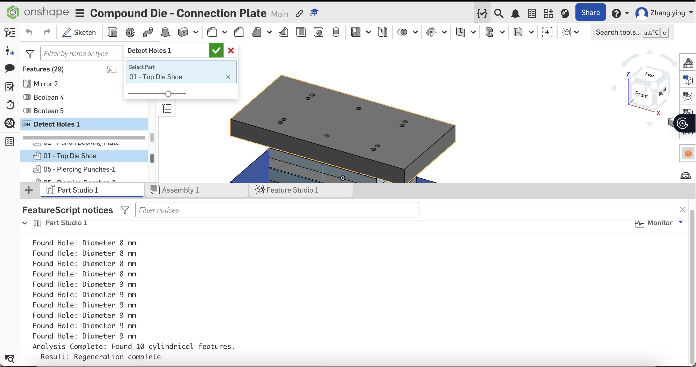
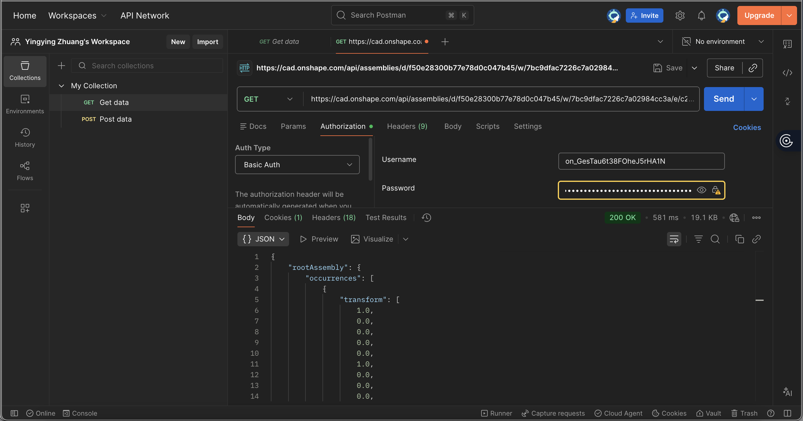

# CloudCAD-Copilot（prototype）: Context-Aware Standard Part Assistant

> An AI assistant (Demo) for automating standard part assembly on Onshape through natural language.
> Combines geometric analysis with engineering knowledge for intelligent recommendations.

## Overview
CloudCAD-Copilot is a "proof-of-concept" agent designed to bridge the gap between natural language commands and CAD geometric constraints. It leverages **LLMs for intent extraction** and **geometric clustering algorithms** to intelligently identify, select, and insert standard parts (e.g., ISO Screws) into the correct locations within an Onshape assembly.

> **Status:** Active Development (Day 2 Complete)
> **Goal:** Eliminate manual lookups for ISO/ASME standard parts in mold design.

## Project Aims
- Hole Clustering: Implemented DBSCAN algorithm to group geometric features.
- Logic Engine: Built engineering reasoning engine based on ISO standards.
- Integration: Currently testing with real Onshape API (moving from mock data).
- UI: Streamlit interface for visualization.

## Core Capabilities
This engineering judgment assistant goes beyond simple commands. It understands:
- Contextual Targeting: How to target the right part in the assembly area.
- Feature Recognition: Distinguishing φ8mm dowel pin holes from φ9mm screw clearance holes.
- Standard Recommendation: Knowing when to recommend standards and which ISO standard applies to the specific geometry.
- Engineering Calculation: Automatically calculating optimal pin/bolt length based on plate thickness.
  
---

## Progress Log

### Phase 2: Geometric Analysis Kernel 
**Objective:** Enable Onshape to "see" and measure features natively.
- Developed a custom **FeatureScript** to analyze B-Rep topology.
- Implemented `evSurfaceDefinition` to distinguish cylindrical holes from other geometries.
- Achieved **Unit Awareness**: Automatically converts internal meters to millimeters for engineering use.
- **Result:** Successfully detected 10+ holes and calculated precise diameters (8mm/9mm) from a raw die shoe model.


*Figure: Custom FeatureScript successfully identifying hole diameters in real-time.*

📂 **Code:** [detectHoles.fs](featurescript/detectHoles.fs)

---

### Phase 1: API Connectivity & Data Retrieval
**Objective:** Establish secure communication with Onshape Cloud.
- Configured **REST API** client using Basic Auth (Access/Secret Keys).
- Successfully called `GET /api/assemblies` to retrieve the full hierarchical structure of a compound die.
- Parsed instance IDs (`elementId`, `partId`) needed for context-aware recommendations.


*Figure: Validated API connection returning live assembly structure (Status 200 OK).*

📂 **Data Sample:** [assembly_data.json](api_tests/assembly_data.json)

---

## Tech Stack
- **Core:** Onshape FeatureScript (Custom Features)
- **Backend:** Python / FastAPI (In Progress)
- **API:** Onshape REST API
- **Tools:** Postman

| Component  | Description |
| :--- | :--- | 
| Core Intelligence | Geometric clustering + Engineering rules, which analyzes spatial data. |
| NLP Parser| GPT-4 for extracting user intent from natural language commands. |
| Onshape Integration  | Hybrid approach: Using mock data for logic validation, transitioning to real API. |
| Streamlit UI | Interactive dashboard to visualize hole clusters and AI recommendations. |

---
## Project Structure

```text
CAD-Copilot/
├── core/                   # Core Intelligence Module
│   ├── nlp_parser.py       # Natural language understanding (Intent Extraction)
│   ├── geometry_analyzer.py# Geometric reasoning & Hole clustering (DBSCAN)
│   └── standard_selector.py# Engineering reasoning & ISO logic
├── data/                   # Data Sources
│   ├── mock_assembly.json  # Mock data (e.g., Blanking die example)
│   └── standards_db.json   # ISO specifications database
├── docs/                   # Documentation
│   ├── DESIGN.md           # System architecture & Design philosophy
│   └── LEARNING_LOG.md     # Daily progress tracker
└── demo/                   # Visualization
    └── streamlit_app.py    # Interactive web interface
```
---
## How to Run (PoC)
```bash
# 1. Install dependencies
pip install streamlit scikit-learn plotly openai

# 2. Launch the application
streamlit run demo/streamlit_app.py
```
